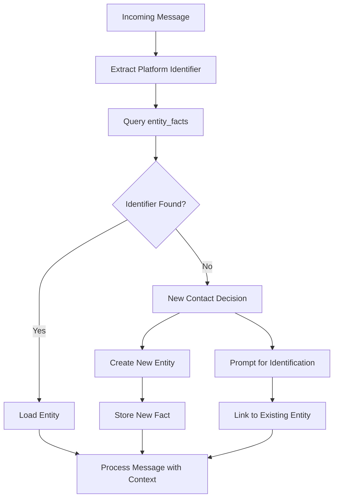

# User Identification Architecture

## Overview

This document describes how NOVA Psyche handles user identification across multiple communication channels. The system must resolve diverse platform-specific identifiers to a single, consistent entity representation while maintaining security and privacy.

## 1. The Problem

Users can contact NOVA via multiple communication channels, each with fundamentally different identifier systems:

- **Heterogeneous Identifiers**: Each platform uses different ID formats (phone numbers, UUIDs, numeric IDs, usernames)
- **Cross-Channel Identity**: A single user may communicate via Signal today, Telegram tomorrow
- **Identity Resolution**: How do we know that `+15551234567` on Signal and `@johndoe` on Telegram are the same person?
- **Data Consistency**: Conversation history, preferences, and context must follow the user across channels
- **Privacy Constraints**: Users may not want to link certain identities, or may prefer anonymity on specific platforms

The core challenge: **How do we resolve multiple platform-specific identifiers to a single entity while respecting user privacy and platform limitations?**

## 2. Current Identifiers by Channel

### Signal
- **Primary**: Phone number in E.164 format (`+1XXXXXXXXXX`)
- **Secondary**: Signal UUID (`ad96ba70-68e0-4f2b-9ec5-503089033a09` format)
- **Notes**: UUIDs are privacy-focused; phone numbers may not always be available

### Telegram
- **Primary**: Numeric user ID (64-bit integer, e.g., `123456789`)
- **Secondary**: Username (optional, user-chosen, e.g., `@johndoe`)
- **Notes**: User IDs are permanent; usernames can change or be unset

### Discord
- **Primary**: Numeric user ID (snowflake format, e.g., `1234567890123456789`)
- **Secondary**: Username + discriminator (legacy: `username#1234`)
- **Notes**: Moving to new username system; snowflakes are permanent

### WhatsApp
- **Primary**: Phone number in E.164 format (`+1XXXXXXXXXX`)
- **Notes**: Directly tied to phone number; no secondary identifiers

### Slack
- **Primary**: Workspace-specific user ID (e.g., `U123456789`)
- **Secondary**: Display name, email (workspace-dependent)
- **Notes**: IDs are workspace-scoped; same person has different IDs across workspaces

### iMessage
- **Primary**: Phone number (`+1XXXXXXXXXX`) or Apple ID email
- **Notes**: May switch between phone/email based on sender's device settings

## 3. Current Storage (entity_facts table)

The `entity_facts` table stores key-value pairs linking platform identifiers to entities:

```sql
CREATE TABLE entity_facts (
    entity_id UUID NOT NULL,
    fact_key VARCHAR(255) NOT NULL,
    fact_value TEXT NOT NULL,
    created_at TIMESTAMP DEFAULT NOW(),
    updated_at TIMESTAMP DEFAULT NOW(),
    PRIMARY KEY (entity_id, fact_key)
);
```

### Standard Fact Keys

| Key | Description | Example Value | Used By |
|-----|-------------|---------------|---------|
| `phone` | Primary phone number | `+15551234567` | Signal, WhatsApp, iMessage |
| `signal_uuid` | Signal-specific UUID | `ad96ba70-68e0-4f2b-9ec5-503089033a09` | Signal |
| `telegram_id` | Telegram user ID | `123456789` | Telegram |
| `telegram_username` | Telegram username | `johndoe` | Telegram |
| `discord_id` | Discord user ID (snowflake) | `1234567890123456789` | Discord |
| `slack_id_<workspace>` | Slack user ID per workspace | `U123456789` | Slack |
| `email` | Email address | `john@example.com` | iMessage, general |

### Fact Key Conventions

- **Namespaced**: Platform-specific facts use prefixes (`signal_`, `telegram_`, etc.)
- **Workspace-scoped**: Multi-tenant platforms append workspace identifier
- **Canonical forms**: Phone numbers in E.164, emails lowercased
- **Immutable primaries**: Core platform IDs (like Discord snowflakes) never change
- **Mutable secondaries**: Display names, usernames may update

## 4. Resolution Flow

### Incoming Message Processing



### Identifier Lookup Process

1. **Extract Platform ID**: Parse the incoming identifier based on channel type
2. **Normalize**: Convert to canonical form (E.164 for phone, lowercase for email)
3. **Query Facts**: `SELECT entity_id FROM entity_facts WHERE fact_key = ? AND fact_value = ?`
4. **Entity Resolution**:
   - **Found**: Load entity context and conversation history
   - **Not Found**: Trigger new contact workflow

### New Contact Workflow

When an unknown identifier appears:

1. **Auto-Create**: For trusted channels or obvious cases (e.g., phone number match)
2. **Prompt User**: Ask if this should link to existing entity
3. **Manual Verification**: For ambiguous cases requiring human confirmation

## 5. Linking Multiple Identifiers

### Cross-Channel Entity Linking

A single entity can have multiple facts, enabling cross-channel continuity:

```json
{
  "entity_id": "550e8400-e29b-41d4-a716-446655440000",
  "facts": {
    "phone": "+15551234567",
    "signal_uuid": "ad96ba70-68e0-4f2b-9ec5-503089033a09",
    "telegram_id": "123456789", 
    "telegram_username": "johndoe",
    "email": "john@example.com"
  }
}
```

### Linking Strategies

1. **Explicit Linking**: User explicitly states "This is also my Telegram"
2. **Phone Number Bridge**: Same phone number across Signal/WhatsApp/iMessage
3. **Email Bridge**: Same email across platforms that support it
4. **Manual Association**: Admin/user manually links identifiers
5. **Confidence-Based**: Future automated linking with confidence scores

### Resolution Priority

When multiple identifiers could match:

1. **Direct Match**: Exact fact_key + fact_value match
2. **Phone Number**: Cross-platform phone number matching
3. **Email**: Cross-platform email matching  
4. **Manual Override**: User-specified associations take precedence

## 6. Edge Cases

### Unknown Sender (New Contact)

**Scenario**: Message arrives from never-seen identifier

**Handling**:
- Create temporary entity with single fact
- Prompt for identification if in private channel
- Auto-create if identifier suggests existing entity (e.g., phone number variation)

### Identifier Changes

**Scenario**: User changes phone number or username

**Handling**:
- Keep old identifier as `deprecated_<key>` for reference
- Add new identifier as current fact
- Maintain conversation history continuity
- Notify system of identifier migration

### Shared Devices

**Scenario**: Multiple people use same device/account

**Handling**:
- Flag entity as `shared_device: true`
- Implement sub-identity system if needed
- Require additional verification for sensitive operations
- Consider message-level attribution prompts

### Group Chats

**Scenario**: Multiple entities in single conversation

**Handling**:
- Track participant list separately from entity resolution
- Resolve each participant to their individual entity
- Handle dynamic membership (joins/leaves)
- Distinguish between entity facts and conversation membership

### Platform Migration

**Scenario**: User migrates from one platform to another

**Handling**:
- Preserve all historical facts
- Mark deprecated identifiers appropriately
- Maintain conversation continuity during transition
- Update primary communication preferences

### Privacy Boundaries

**Scenario**: User wants to keep platform identities separate

**Handling**:
- Respect user preference for identity isolation
- Implement per-entity privacy settings
- Allow selective fact sharing/hiding
- Support multiple entities per real person if desired

## 7. Gaps/Future Work

### Automatic Cross-Channel Linking

**Current State**: Manual linking required for most cases

**Future Enhancement**: 
- Behavioral pattern analysis
- Timestamp correlation (messages sent simultaneously across channels)
- Natural language fingerprinting
- Opt-in automatic linking with user consent

### Confidence Scoring

**Current State**: Binary match/no-match decisions

**Future Enhancement**:
```json
{
  "entity_match": {
    "entity_id": "550e8400-e29b-41d4-a716-446655440000",
    "confidence": 0.85,
    "reasons": ["phone_number_match", "temporal_correlation"],
    "manual_verification_required": true
  }
}
```

### Ambiguous Identifier Handling

**Current State**: Manual resolution for conflicts

**Future Enhancement**:
- Machine learning for disambiguation
- Context-aware identifier resolution
- User feedback loops for improving accuracy
- Graceful degradation when certainty is low

### Privacy-Preserving Linking

**Current State**: Full identifier storage

**Future Enhancement**:
- Cryptographic hashing for privacy
- Zero-knowledge identity proofs
- Differential privacy for behavioral linking
- User-controlled identity revelation

### Advanced Analytics

**Current State**: Basic entity tracking

**Future Enhancement**:
- Cross-channel conversation flow analysis
- Entity relationship mapping (friends, family, colleagues)
- Communication preference learning
- Fraud/impersonation detection

### Platform-Specific Enhancements

#### Signal
- Enhanced UUID handling
- Contact discovery integration
- Profile key verification

#### Telegram
- Bot API integration improvements
- Group management enhancements
- Channel subscription tracking

#### Discord
- Guild-specific identity management
- Role-based entity attributes
- Voice channel presence correlation

## Implementation Notes

### Performance Considerations

- Index `entity_facts` on `(fact_key, fact_value)` for fast lookups
- Cache frequently-accessed entity resolutions
- Batch identifier normalization for efficiency
- Consider read replicas for high-volume identifier resolution

### Security Considerations

- Hash sensitive identifiers where possible
- Implement rate limiting on entity creation
- Audit trail for all entity linking/unlinking operations
- Secure storage of platform-specific tokens/credentials

### Monitoring and Observability

- Track identifier resolution success rates
- Monitor new contact creation patterns
- Alert on unusual linking activity
- Measure cross-channel conversation continuity

---

This architecture enables NOVA Psyche to maintain consistent user identity across diverse communication platforms while respecting privacy boundaries and handling the complexity of real-world identity management scenarios.